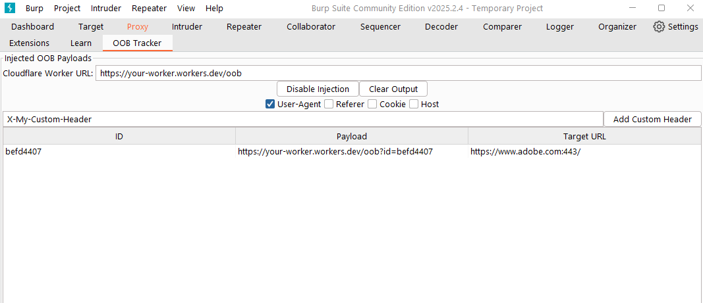
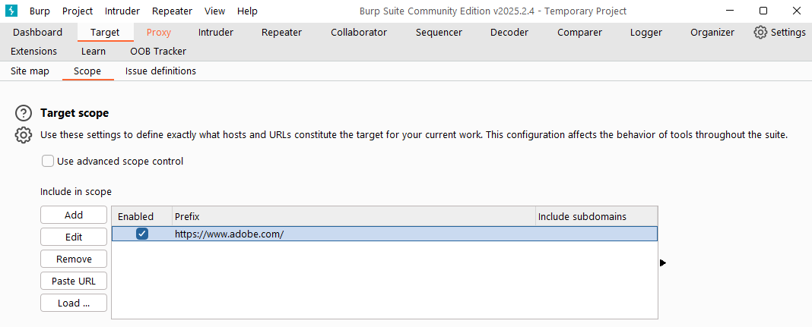
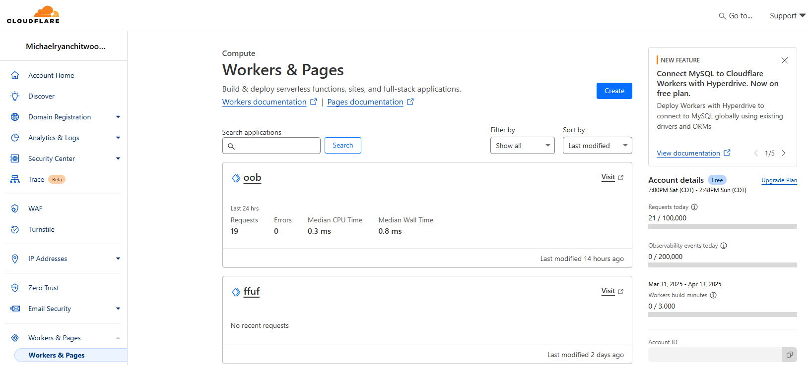

# Cloudflare OOB Injector for Burp Suite

An easy-to-use Burp Suite extension that injects Cloudflare Worker OOB (Out-Of-Band) payloads into HTTP requests for testing SSRF, RCE, and various injection scenarios. Leveraging Cloudflare's extensive global network, this approach may bypass certain WAF configurations, rate limiting, and network controls, potentially revealing otherwise hidden internal details. This extension makes it simpler to detect and capture callbacks via your Cloudflare Worker endpoint.



---

## Table of Contents
- [Features](#features)
- [Screenshots](#screenshots)
- [Prerequisites](#prerequisites)
- [Installation](#installation)
- [Usage](#usage)
- [License](#license)

---

## Features

- **One-Click Injection** – Toggle injection on or off in Burp Suite, and modify common headers (User-Agent, Referer, Cookie, Host).
- **Custom Header Support** – Add any custom headers you need, each linking to your Cloudflare Worker URL for out-of-band testing.
- **Logging** – Track each injected payload in a dedicated table for easy reference.

---

## Screenshots

1. **OOB Tracker Tab in Burp Suite**

   

   *Displays the extension's custom tab, showing injection status, headers, and an example payload row.*

2. **Burp Suite Target Scope**

   

   *Demonstrates how you might configure the scope to control which requests Burp sends to the extension.*

3. **Cloudflare Workers Dashboard**

   

   *Example Cloudflare Workers dashboard showing multiple deployed Workers, including the 'oob' Worker used for OOB callback collection.*

---

## Prerequisites
- **Burp Suite Community or Professional Edition** (2023.x or later recommended)
- **Jython** (if you plan to use Python-based extensions in Burp)
- **Cloudflare Account** (for hosting your Worker at a `.workers.dev` address)

---

## Installation

1. **Clone or Download the Extension**  
   - Download the `.py` file (or the repository) containing the code for the extension.

2. **Load into Burp Suite**  
   - Go to **Extender** → **Extensions** → **Add**.  
   - Select “Extension Type” = Python.  
   - Choose the `.py` file you downloaded.  
   - Ensure **Python Environment** is set to your Jython .jar path.

3. **Verify Installation**  
   - Check the **Extender** → **Extensions** tab to see if it loaded without errors.  
   - You should see a new tab titled **“OOB Tracker”** in Burp Suite.

---

## Usage

Before proceeding, **set your target scope in Burp Suite and enable the Interceptor** as shown in the screenshots—this prevents the extension from spraying every URL that comes through.

1. **Set Cloudflare Worker URL**  
   - Inside **OOB Tracker** tab, update “Cloudflare Worker URL” to match your worker endpoint, for example:  
     ```
     https://my-oob-worker.workers.dev/oob
     ```

2. **Enable Injection**  
   - Click **“Enable Injection”**. Now the extension will intercept requests passing through Burp.

3. **Check Headers to Inject**  
   - By default, “User-Agent” is selected. You can optionally tick **Referer**, **Cookie**, or **Host** to inject your OOB payload.

4. **Add Custom Headers**  
   - Type a header name (e.g., `X-My-Test-Header`) and click **“Add Custom Header”**. Each custom header will automatically include the OOB payload.

5. **Monitor Payload Hits**  
   - When your payload fires, each new row in the “Injected OOB Payloads” table shows:
     - **ID** (unique identifier for tracking)  
     - **Payload** (the Cloudflare Worker URL)  
     - **Target URL** (the original request’s destination)

6. **Check Cloudflare Logs**  
   - In your Cloudflare dashboard, open your Worker’s **Logs** tab (beta) or use `wrangler tail` to see incoming requests with the unique ID.

---

## License

This project is released under the [MIT License](LICENSE). Feel free to modify and adapt it for your own pentesting setups.

---

### Contributing

1. Fork this repository  
2. Create a new feature branch (`git checkout -b feature/awesome-addition`)  
3. Commit your changes (`git commit -m 'Add my awesome new feature'`)  
4. Push to the branch (`git push origin feature/awesome-addition`)  
5. Open a Pull Request

---

**Happy Testing!** If you have any questions or issues, open a ticket or reach out to the repo maintainer.
